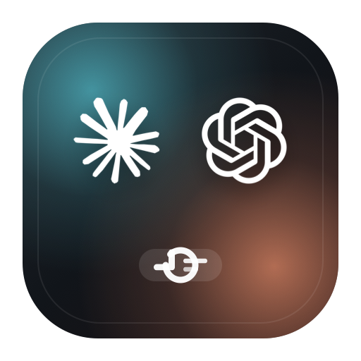
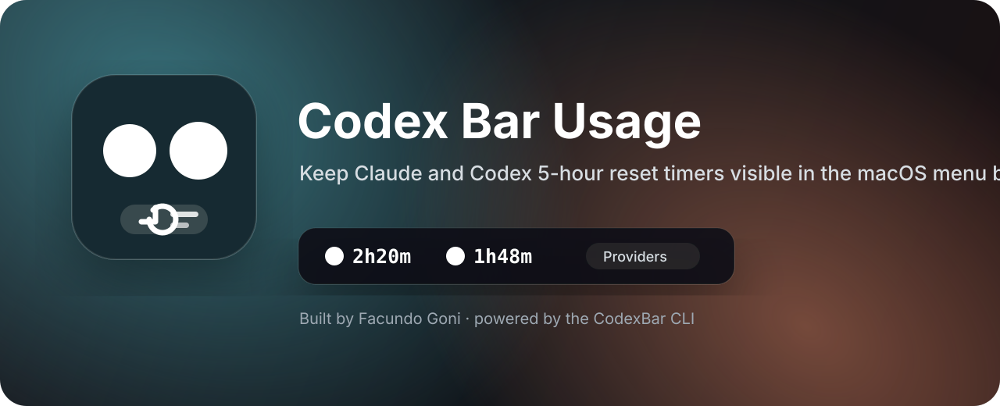

<p align="center">
  
</p>

<h1 align="center">CodexResetBar</h1>

<p align="center">
  A small macOS menu bar companion for CodexBar that keeps provider reset timers visible at a glance.
</p>

<p align="center">
  
  
  
</p>



## What It Does

CodexBar already shows usage percentages in the macOS menu bar. CodexResetBar fills the smaller gap: it shows how long remains until the current 5-hour limits reset.

The menu bar title stays compact:

```text
[Claude icon] 2h20m   [Codex icon] 1h48m
```

Click the menu bar item to see details, refresh manually, quit the app, or choose which providers appear.

## Features

- Shows enabled provider reset countdowns directly in the menu bar.
- Ships with CodexBar-style SVG marks for supported providers.
- Reads usage data through the local `codexbar` command-line interface.
- Lets you choose visible providers from a `Providers` submenu.
- Persists provider visibility with `UserDefaults`.
- Keeps at least one provider enabled.
- Installs as a menu bar-only app with no Dock icon.

## Supported Providers

Claude and Codex are enabled by default. The provider picker can also show:

- Cursor
- MiniMax
- Grok
- Groq Cloud
- z.ai
- Gemini
- Antigravity
- Copilot
- OpenRouter
- Kilo
- Kiro
- Droid / Factory
- Vertex AI

## Data Sources

The app shells out to CodexBar instead of talking to provider APIs directly:

```bash
codexbar usage --provider codex --format json --source cli
codexbar usage --provider claude --format json --source oauth
codexbar usage --provider <provider> --format json --source auto
```

That keeps this app focused on display and lets CodexBar own auth, parsing, and provider-specific behavior.

## Requirements

- macOS 14 or later.
- Swift Package Manager for development.
- CodexBar installed.
- The `codexbar` CLI available at `/opt/homebrew/bin/codexbar`.
- Valid local sessions, cookies, or tokens for the providers you enable.

## Install Locally

```bash
make install
```

`make install` builds the release binary, copies the app to `/Applications/CodexResetBar.app`, restarts any existing copy, and opens the new one.

## Development

```bash
make test
make icon
make app
make install
```

`make icon` regenerates `Assets/AppIcon.icns` from `Assets/AppIcon.svg`. The generated app bundle includes the app icon, provider SVG resources, and an `LSUIElement` setting so the app stays out of the Dock.

## Logs

CodexResetBar writes provider and CodexBar CLI activity to unified logging:

```bash
log stream --predicate 'subsystem == "com.lcc.codexresetbar"' --style compact
```

Useful events include provider toggles, refresh starts, CodexBar command attempts, provider reset successes, and provider fetch failures.

## Human Guidelines

Use `make install` for local installs. It copies the app to `/Applications/CodexResetBar.app` and opens it.

## Agent Guidelines

After changing app behavior, resources, packaging, or menu bar rendering, run the tests and install the app so the local menu bar copy reflects the change:

```bash
make test
make install
```

## Project Layout

```text
Assets/                         App icon source and generated .icns
Sources/CodexResetBar/          AppKit menu bar app
Tests/CodexResetBarTests/       Swift Testing coverage
scripts/                        Local asset generation scripts
```

## Author

Created by Facundo Goni as a companion utility for CodexBar.

## Notes

CodexResetBar is intentionally small. It is not a replacement for CodexBar, and it does not manage authentication. If a provider stops showing reset data, verify that CodexBar can read that provider first.
